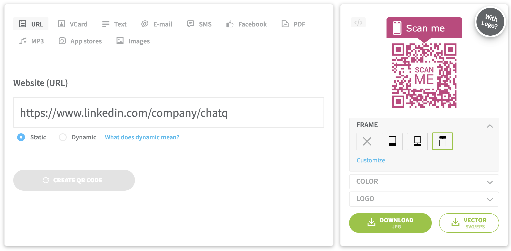

# Tasks

Generate QR code pictures based on given link. Can generate a batch of QR given some dynamic link.



# Features

- User can upload custome frame for the QR
- User can choose color
- User can insert a logo in the middle of the QR (only for small resoluiton of QR because the middle is the checksum)

# Work

- [x] Choose a QR generator library. [qrcode-svg](https://github.com/papnkukn/qrcode-svg)
- Setup the link form and the customize area
- Make responsive

# qrcode-svg

```javascript
var QRCode = require('qrcode-svg');
var svg = new QRCode('Hello World!').svg();

var qrcode = new QRCode({
  content: 'http://github.com/',
  padding: 4,
  width: 256,
  height: 256,
  color: '#000000',
  background: '#ffffff',
  ecl: 'M',
});
qrcode.save('sample.svg', function(error) {
  if (error) throw error;
  console.log('Done!');
});
```

## List of options:

- content - QR Code content, required
- padding - white space padding, 4 modules by default, 0 for no border
- width - QR Code width in pixels
- height - QR Code height in pixels
- color - color of modules, color name or hex string, e.g. #000000
- background - color of background, color name or hex string, e.g. white
- ecl - error correction level: L, M, H, Q


